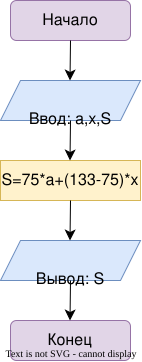

# Домашнее задание

## Условие задачи
Мальчик, продающий на улице газеты, зарабатывает **a руб.** на продаже первых **75 газет**. На каждой из остальных проданных газет он зарабатывает по **x руб.** Напишите программу, которая выведет на дисплей заработок мальчика, если он продаст **133 газеты**.

---

## 1. Алгоритм

### Текстовый алгоритм
1. **Начало.**
2. **Задать исходные данные:**
   * `a` — заработок за первые 75 газет (руб.).
   * `x` — заработок за каждую последующую газету (руб.).
3. **Вычислить заработок:**
   * Рассчитать общую сумму по формуле: `S = a + 58 * x`.
4. **Вывод данных:**
   * Вывести значение `S` на экран.
5. **Конец.**
## 2. Блок-схема

[](https://viewer.diagrams.net/?tags=%7B%7D&lightbox=1&highlight=0000ff&edit=_blank&layers=1&nav=1&dark=auto#R%3Cmxfile%3E%3Cdiagram%20name%3D%22%D0%A1%D1%82%D1%80%D0%B0%D0%BD%D0%B8%D1%86%D0%B0-1%22%20id%3D%22vYnkC4cLGcOmQwEQ1W34%22%3E7Zhdb5swFIZ%2FDdJWqRXYfOWySbpuUidVi9Rtly4cgjWDkXEasl8%2FAyZ8pU2aLd2q9aIufm0fw3leYwcDz5LiWpAs%2FsxDYAYyw8LAcwMhF09UWQobLdh2LSwFDWvJaoUF%2FQlaNLW6oiHkvY6ScyZp1hcDnqYQyJ5GhODrfreIs%2F6sGVnCSFgEhI3VrzSUca36yGv1j0CXcTOz5eoHTkjTWT9JHpOQrzsSvjLwTHAu66ukmAErc9fkpR734ZHW7Y0JSOUhA8g8%2BMITT96tWU7vQhQvbm7Od0TRUi43TQ4EX6UhlGEsA0%2FXMZWwyEhQtq4VdKXFMmG6WXe%2BBUETkCC0HFHGZpxxUYXEYIUOeErPpeA%2FoNMycT1M3HIET6X2g1XW69t6IGylb8uYm8ZkXpZT01CT%2BF5zrcppVV7pQSAkFJ3H0xm6Bq7uUWxUl7gD0dbE1i1wq6HYRPF0fTNoJ9pvy23oFom60FSeQQgdQkh5KysvVS%2FCGDC%2BFCRROcs6FHptHTz7gFaxP6W5WodblgU0S3UH25CAHwW72LqBD%2FfRwWyrcoo0ybK0DXxZJtlAs0L9Lf4YXnuA1%2B3jReap8OLnLUBzP68BjSiKULCTRujeu85BK22h%2FnnOmUr79J2F8bnnvD8rXiz3%2Fqlyb%2F%2FXS0u9MKePLbAXW1jYPRVc57XvbJcdLPUu51TQ3Jfa02z7VGz0I0A4OnuNYfGVCGD%2FCaYDFdLwsjz5qVrASJ7TYCdH%2FTbtwkAVNiIawVd1Fa1TC1biYesXKKj8Voa5cHTte6dlXugZqspGV8as96JzNAYBjEj60E9Zh6fTx3luXvjWxH8cYTWryhTZdDpknKYy7x8kb0utDYzw4OzjDHxSM9OjngqEJhfO0%2FusgrEEOQpVuW6bruON6D%2FDiG8G%2B1sGQ8MX0W8YbHiYOLHBJm8GewUGw8Nfb8cbbHSgObHBmu8kbw77px1mDze24x02OpYd7TBVbT8%2F1d3bb3j46hc%3D%3C%2Fdiagram%3E%3C%2Fmxfile%3E)

