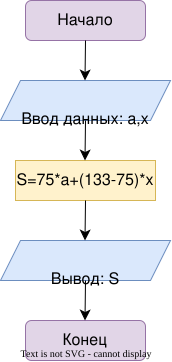

# Домашнее задание

## Условие задачи
Мальчик, продающий на улице газеты, зарабатывает **a руб.** на продаже первых **75 газет**. На каждой из остальных проданных газет он зарабатывает по **x руб.** Напишите программу, которая выведет на дисплей заработок мальчика, если он продаст **133 газеты**.

---

## 1. Алгоритм и блок-схема

### Алгоритм
1. **Начало.**
2. **Задать исходные данные:**
   * `a` — заработок за первые 75 газет (руб.).
   * `x` — заработок за каждую последующую газету (руб.).
3. **Вычислить заработок:**
   * Рассчитать общую сумму по формуле: `S = a + 58 * x`.
4. **Вывод данных:**
   * Вывести значение `S` на экран.
5. **Конец.**
### Блок-схема

[](https://viewer.diagrams.net/?tags=%7B%7D&lightbox=1&highlight=0000ff&edit=_blank&layers=1&nav=1&dark=auto#R%3Cmxfile%3E%3Cdiagram%20name%3D%22%D0%A1%D1%82%D1%80%D0%B0%D0%BD%D0%B8%D1%86%D0%B0-1%22%20id%3D%22vYnkC4cLGcOmQwEQ1W34%22%3E7Zhdb5swFIZ%2FDdJWqRXYfOWySbpuUidVi9Rtly4cgjWDkXEasl8%2FAyZ8pUuaNd2q9caxX9vHcJ7X4GDgWVJcC5LFn3kIzEBmWBh4biDk4okqS2GjBduuhaWgYS1ZrbCgP0GLplZXNIS8N1ByziTN%2BmLA0xQC2dOIEHzdHxZx1l81I0sYCYuAsLH6lYYyrlUfea3%2BEegybla2XH3DCWkG6zvJYxLydUfCVwaeCc5lXUuKGbAyd01e6nkfHundXpiAVB4ygcyDLzzx5N2a5fQuRPHi5uZ8RxQt5XLT5EDwVRpCGcYy8HQdUwmLjARl71pBV1osE6a79eBbEDQBCULLEWVsxhkXVUgMVuiAp%2FRcCv4DOj0T18PELWfwVGo%2FWGW7vqwHwlb6soy5aUzmZTk1DbWI7zV1VU6r8kpPAiGh6NyeztA1cHWNYqOGxB2Itia2boFbDcUmiqfbm0E%2F0X5bbkO3SFRFU3kCIXQIIeWtrKyqUYQxYHwpSKJylnUo9Po6ePYBrWJ%2FSnO1D7csC2i26g62IQE%2FCnaxdQMf7qOD2VblFGmSZameHaautKjnTaksMK1Kx8CXJQsDzYpnc4A3cIDt9ByAzFM5AD9tj5r7kQ6ARVGEgp3AQvfedQ7ajAv14zlnKuXTdxbG557z%2Fuz5cm8Pcu%2F2dx%2FyT5V7%2B7%2FeffWGGu3BanMtXmpjYfdUcJ3X%2FvK77GCpn4JOBc19qdeebZ%2BKjb4FCEfHszEsvhIB7D%2FkdKBCGl6Wh0PVChjJcxrs5Kifpl0YqMJGRCP4qq2idVrBSjxs%2FQIFld%2FKMBeObn3v9MwLvULV2OjGmPVedI7GIIARSR%2F6KevwdPo4z80L35r4jyOsVlWZIpvOgIzTVOb9s%2BZtqbWBER4cj5yBT2pmetbvAqHJxZ73rIKxBDkKVblum67jjeg%2FwYhvBvtbBkPDB9EfGGx4mDixwSZvBnsFBsPDP3jHG2x0oDmxwZpPKW8O%2B6cdZg9fbMc7bHQsO9phqtl%2BoaqHt5%2F58NUv%3C%2Fdiagram%3E%3Cdiagram%20id%3D%227_pry1ZoyeZuHqAwxt9I%22%20name%3D%22%D0%A1%D1%82%D1%80%D0%B0%D0%BD%D0%B8%D1%86%D0%B0-2%22%3E1VjbcpswEP0aHt3hZowf40vTzrQzmXp6Sd40oAAdgRghjOnXd4GVubiO4xQ7yYNl7dGustrds5KjWct4dytIGn7lPmWaqQci8jVrpZmmAR8AUhLQBtAboNLYRH8QNBSaRz7NepaScyajtA96PEmoJ3sYEYIXfbVHzg7d2HiE0QP0Z%2BTLsEFdc9bin2gUhOoPGc68WYmJUkbHs5D4vOhA1lqzloJz2czi3ZKyKjIqLo3dxyOre8cETeRzDGxpZdtJwe4fPOmQrcUD%2B8fEsJptqB8MD9zui1DGc%2BHRpzZDPVmq6FXbblBMeAJfCy8XW1q5ZIAgeJ74taSrpVvKYypFiRpcyJAHPCHsC%2Bcpgr%2BplCWWBsklByiUMcPVR55IXDQgyotMEqEAF2Sa%2BB0JS4iIgMonzuY2elvCcjzbPoVQ2MpnUxeUERlt%2B8EkWHPBXq%2FNE0wwVeek7XiS2uC3wa2iUoSRpJuU1BksgIn9oKHyHRURuEgFwoenhkzNV9W40DVQcWdqDuOiHtdoRIWku45zh8EKO8yxkSZFyzJDUQd3mUwVUCLgKKvxI2yPSAz3PRIDTinKX5UHH6ZKvEeHamG160klSs8klGGOzSg0veMR5KctGtsZFI09GxRN4yvaDeqmjfqLS8l9DlnhdkirKWgRxijjgSAxRDPtELK31mHqKW7Xe39OMrg4VSVEO6pyfZzm9bgwkdTVCKTQcdKyfqVG6AaLeoR6uQHN75q5%2FDZaM7CHzcAa5HXqXKwZOCM2g%2FnbaAYvpfdFbldD%2F3dNXOc2nb9Hgl6NVrZ%2BMVrpr%2FuMuel0tqaJTev25VzvAWOZFwvudMSepS7r125ab%2BoFMx%2F7AfN%2F%2BTbPI5N%2BmkyXazoneWG75%2FMCxPbXdPN4a%2F%2FhYK3%2FAg%3D%3D%3C%2Fdiagram%3E%3C%2Fmxfile%3E)
## 2. Реализация программы
```c
#include <stdio.h>
void main() {
    int a=18, x=20, S;
    S = 75*a+(133-75)*x;
    printf("%d",S);
}
```
## 3. Результат работы программы
2510
## 4. Информация о разработчике
Гаврилова Анна, бИД-262
